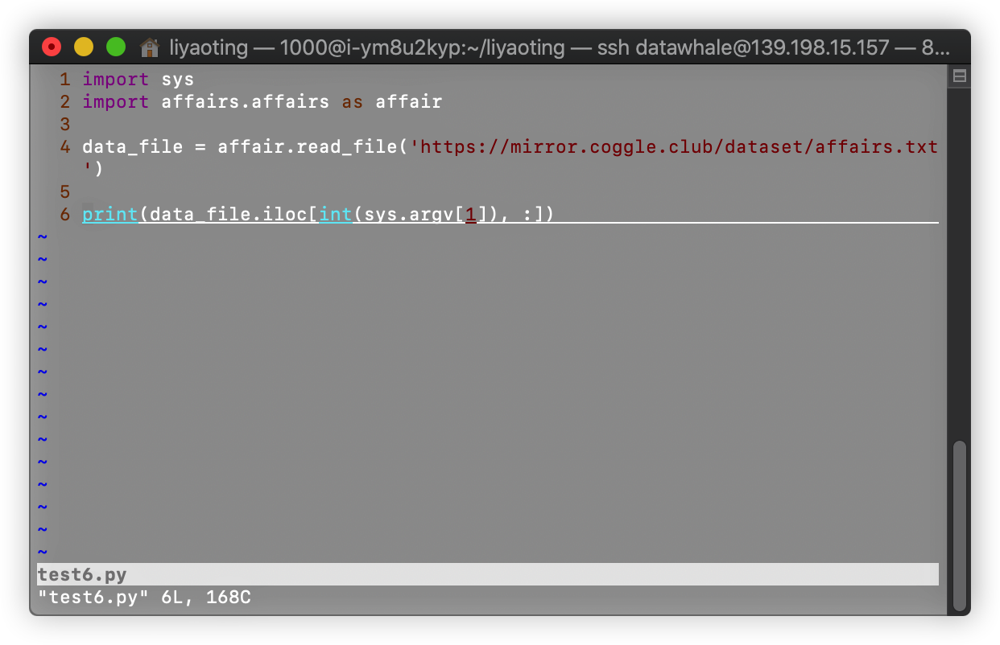
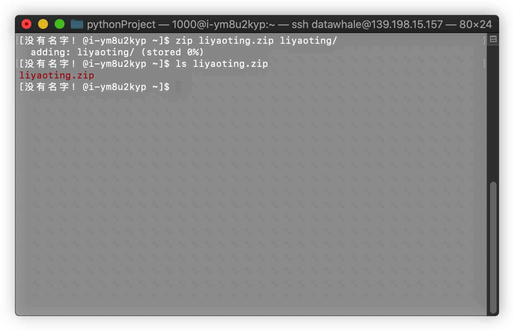

# Linux_DataWhale 学习总结

### 任务1-使用命令行登录指定的Linux环境

登录：ssh 用户名@IP

### 任务2-在目录下创建文件夹、删除文件夹

### 任务3-在目录下下载文件、阅读文件

### 任务4-使用vim编辑文件

### 任务5-在目录下创建py文件，并进行运行

### 任务6-python代码模块化

### 任务7-使用tmux后台运行程序并打印日志

### 任务8-使用grep从文件内容中筛选字符串并使用sed对文件数据行进行更改

### 任务9-压缩与解压缩

### 任务10-利用find和locate对文件定位

